# 基于Springboot的网上购物商城系统

## Springboot-0029


## 技术栈

Springboot mybatisplus vue mysql maven


## 数据库表(13张)


## 功能介绍

```properties
用户：用户在系统前台可查看系统信息，包括首页、商品信息等，注册登录后主要功能模块包括购物车、个人中心、我的地址、我的收藏管理以及订单管理

管理员：管理员登录后可对系统进行全面的管理，主要功能模块包括个人中心、用户管理、商家管理、商品分类管理、商品信息管理、我的收藏管理、系统管理以及订单管理。

商家注册登录后主要功能模块包括个人中心、商品信息管理、我的收藏管理以及订单管理。
```


## 图片

### 前台

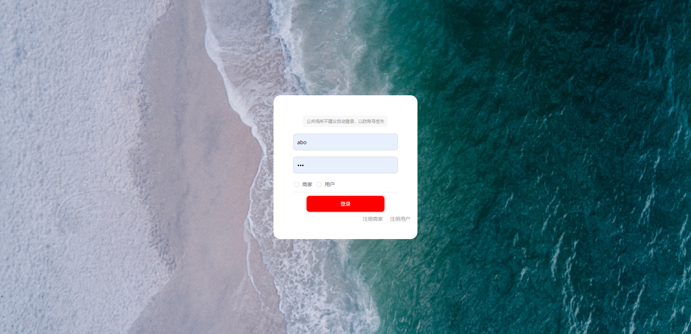

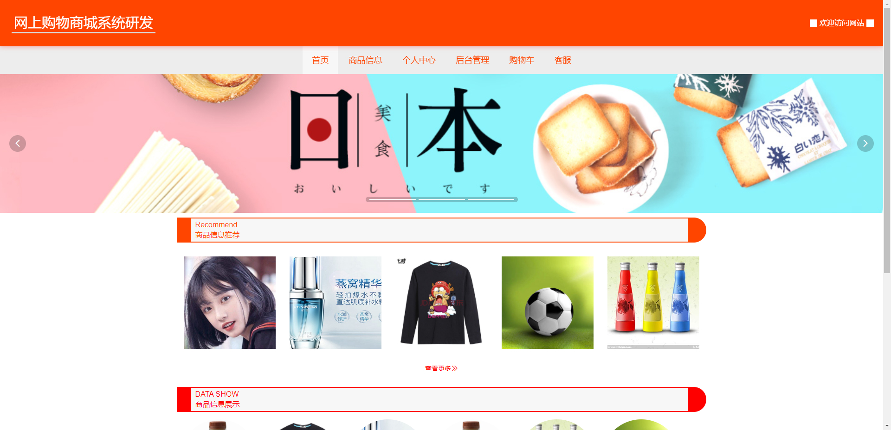


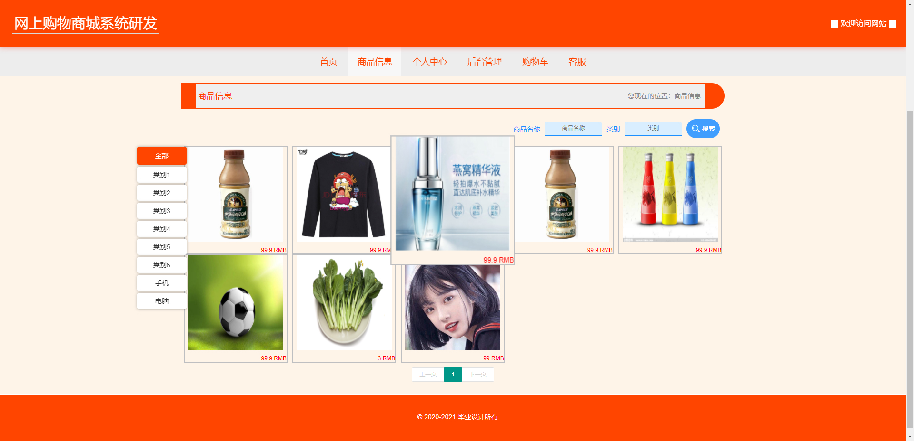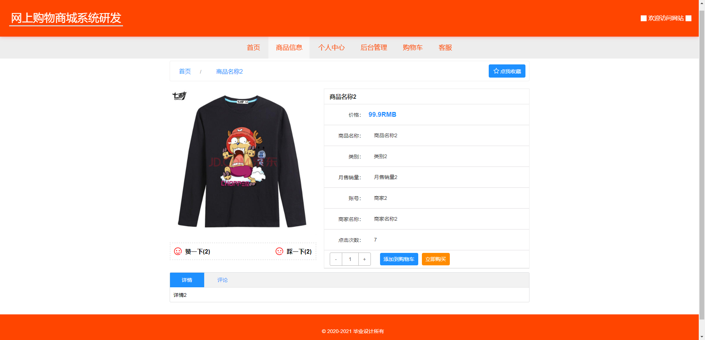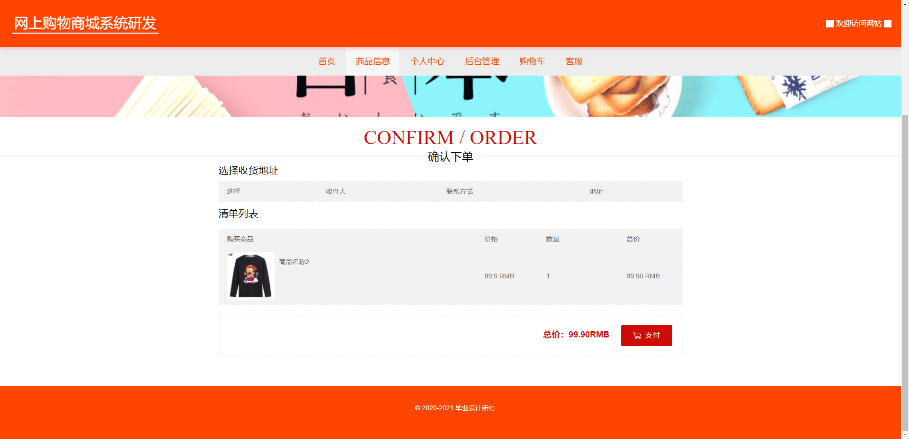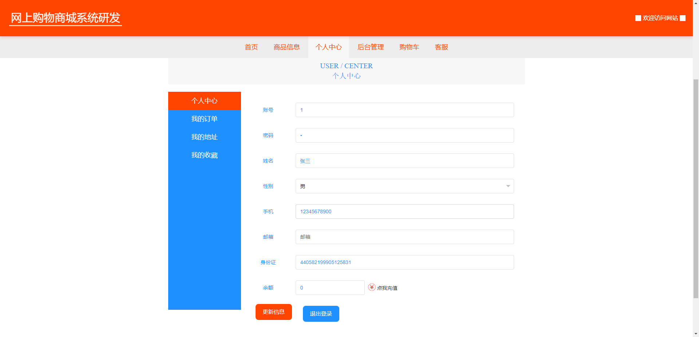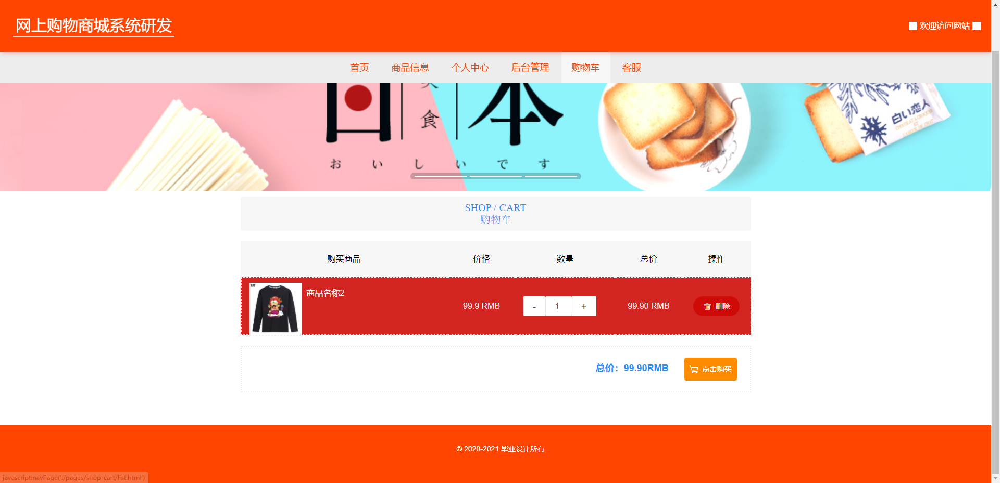

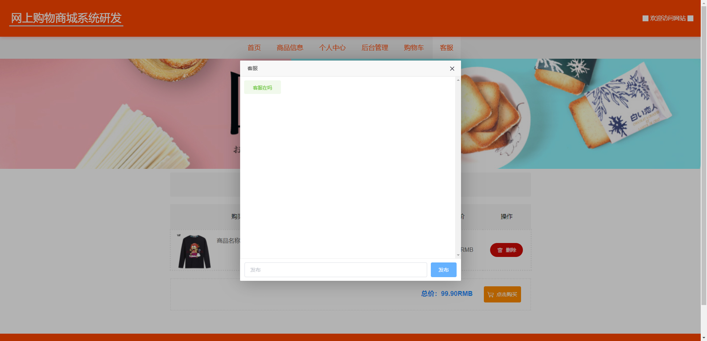

### 后台


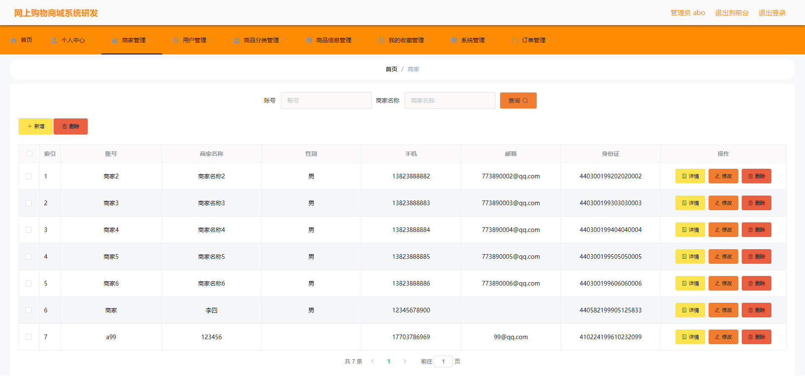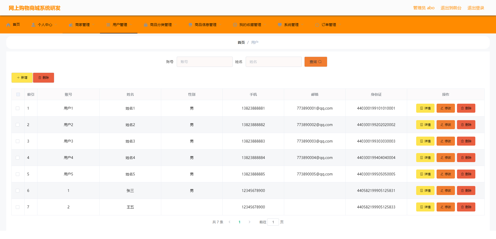

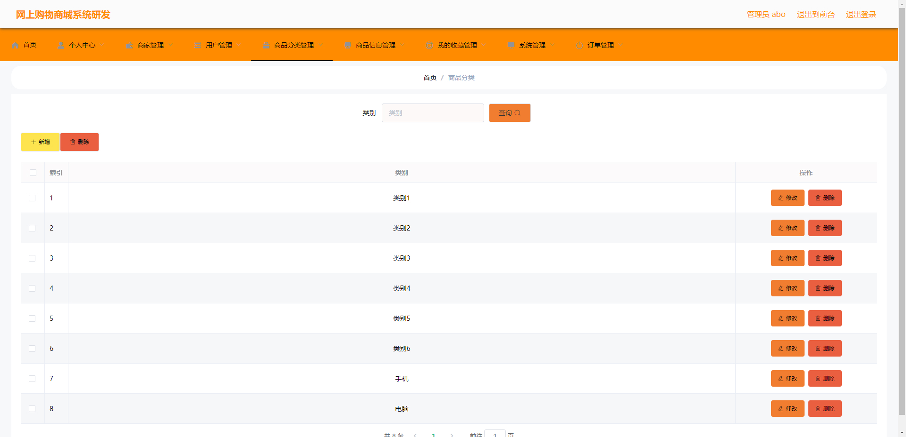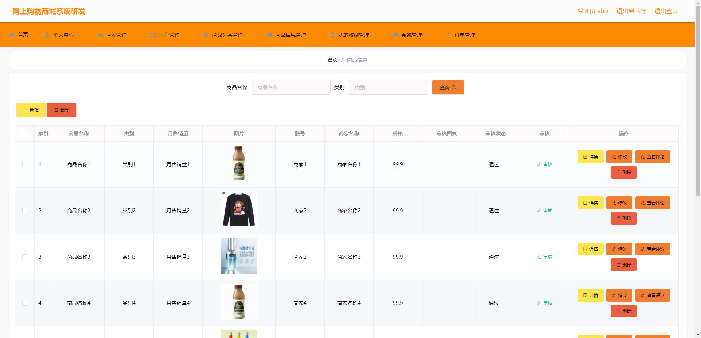

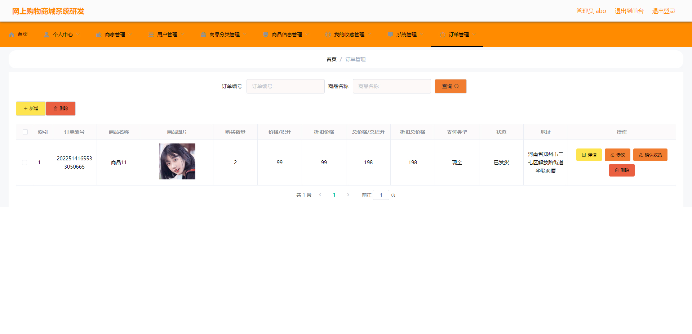

## 访问路径

### 前台

```properties
http://localhost:8080/springboot482k3/front/pages/login/login.html

账号 1
密码 1
```

### 后台

```properties
http://localhost:8080/springboot482k3/admin/dist/index.html#/login

账号 abo
密码 abo
```


## 功能图

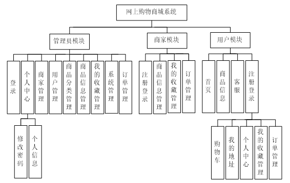


## 文档目录

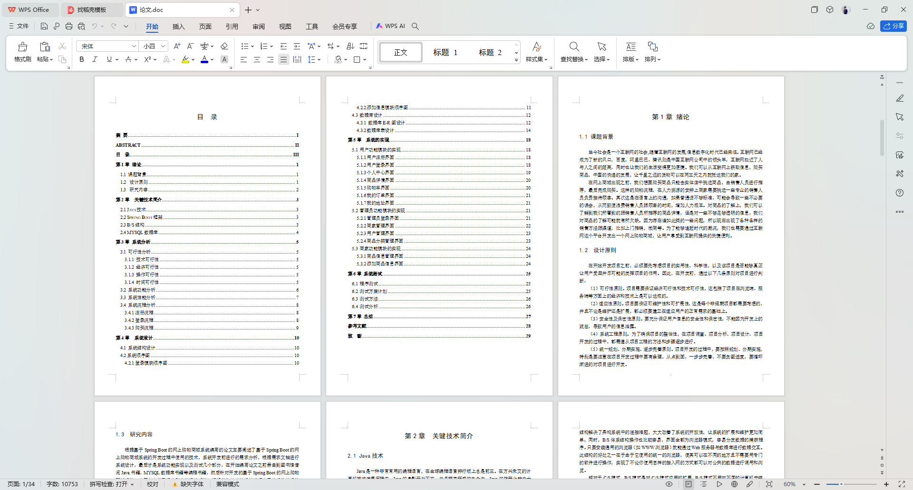


## 打赏或交流


